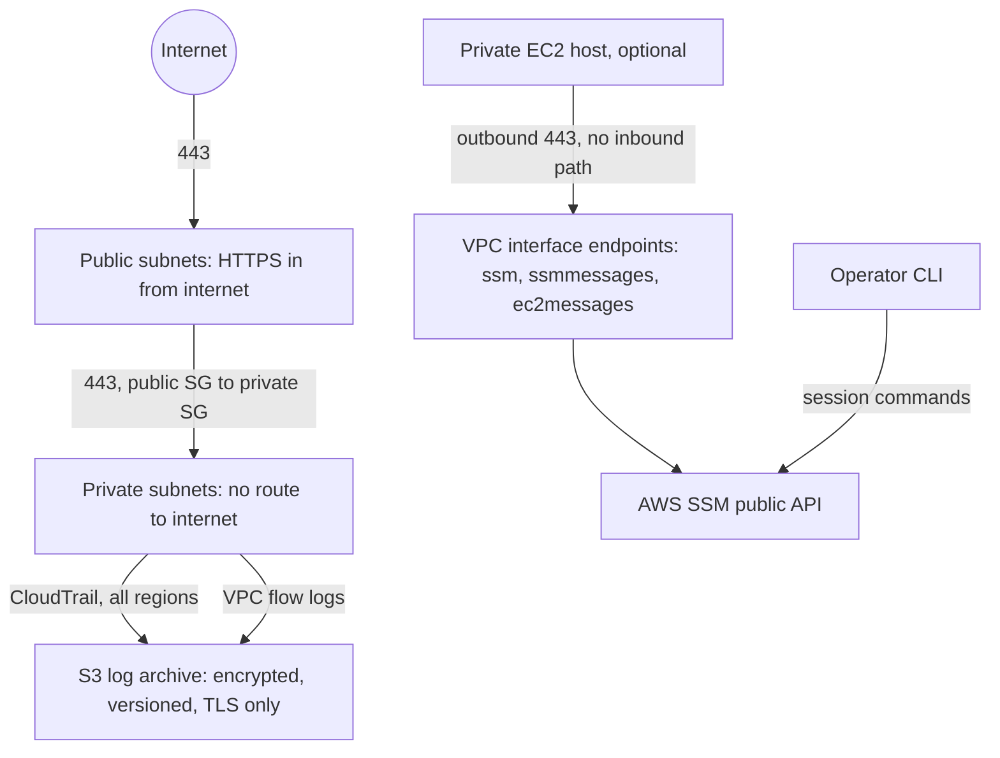
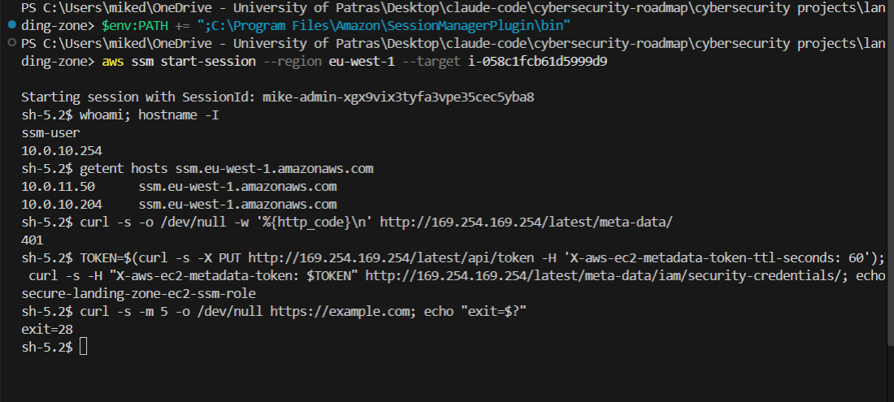

# AWS Secure Landing Zone: Terraform

<div align="center">


</div>

---

## Project Overview

This is a hands-on infrastructure project I built as part of my journey into Cloud Security. The idea was simple: instead of clicking through the AWS Console, write everything as code using Terraform. That way the setup is reproducible, easy to audit, and something I can actually show in a portfolio.

The goal is to build a secure AWS environment from scratch. Isolated networking, firewall rules, IAM permissions, encrypted storage, and audit logging. Each piece reflects something you would actually find in a production cloud environment.

### What This Project Covers
- Secure AWS network architecture using VPC, subnets, and routing, across two availability zones
- Infrastructure as Code with Terraform
- Network isolation between public and private resources
- Security groups to control traffic at the resource level
- Private-subnet access through SSM Session Manager over VPC endpoints: no SSH, no public IP, no NAT (proven end to end, see Phase 2b)
- Encrypted S3 storage with public access fully blocked
- CloudTrail audit logging across all regions
- VPC flow logs for network-level visibility

---

## Architecture



This repo proves one thing end to end: private-subnet reachability with no
SSH, no NAT gateway and no inbound path, using SSM Session Manager over VPC
interface endpoints. It is a separate, smaller-scope project from
[novapay-security-infra](../novapay-security-infra), not a piece it depends
on: novapay builds its own multi-account landing zone, networking and
guardrails from scratch, and shares no code with this repo. The host opens an
outbound connection to the interface endpoints, the operator talks to the
public SSM API, and there is no inbound path into the VPC. That absence of an
inbound route is the point of the design.

---

## Phases

```
Phase 1: Networking        (Completed)
         ↓
Phase 2: Security Groups & IAM  (Completed)
         ↓
Phase 3: Encrypted Storage (S3)  (Completed)
         ↓
Phase 4: Audit Logging (CloudTrail + VPC flow logs)  (Completed)
         ↓
Phase 2b: SSM access proof via VPC endpoints  (Completed)
         ↓
Phase 5: Monitoring & Alerting  (Not built, see below)
```

---

## Phase 1: Networking (Completed)

### `providers.tf` and `variables.tf`
Region, project name, VPC CIDR and AZ count are variables with defaults, so a clean clone plans without a tfvars file; `terraform.tfvars.example` shows what to override. Nothing else is a variable on purpose: a knob for a value that never changes is noise. `default_tags` stamps `Project` and `ManagedBy` on every resource so everything the repo created can be found and cost-attributed.

### `vpc.tf`: Virtual Private Cloud
The isolated network that contains everything. Nothing enters or exits unless explicitly configured.
- CIDR: `10.0.0.0/16` (variable)
- DNS support and hostnames enabled, required later by VPC interface endpoints with private DNS
- **Default security group locked down**: every VPC ships with a default SG that allows all traffic from itself. Adopting it with no rules strips them, so nothing can run on implicit network permissions (CIS AWS Foundations)
- Availability zones come from a data source filtered to `opt-in-not-required`. AZ names are per-account aliases; the physical zone IDs are exposed as an output

### `subnets.tf`: Public & Private Subnets, per AZ
One public and one private subnet in each of two AZs, keyed by AZ name (`for_each`), so removing an AZ does not shift the others. CIDRs are carved with `cidrsubnet()` from the VPC range: /24 slots 0-9 for public, 10-19 for private, leaving room for more AZs and a third tier without renumbering.
- **Public** (`10.0.0.0/24`, `10.0.1.0/24`): "public" means a route to the IGW exists, not that hosts are reachable; `map_public_ip_on_launch` is explicitly false
- **Private** (`10.0.10.0/24`, `10.0.11.0/24`), private by routing: no `0.0.0.0/0` route in their route tables

### `internet_gateway.tf`: Internet Gateway
Connects the VPC to the internet. Attaches at the VPC level, not to individual subnets.

### `route_tables.tf`: Route Tables
Controls where traffic goes:
- One public route table, shared by every public subnet → `0.0.0.0/0` → Internet Gateway. The IGW is VPC-scoped, so there is nothing zonal to isolate
- One private route table **per AZ**, explicitly associated, local route only. Explicit over implicit (an unassociated subnet falls back to the VPC main table, a default nobody owns), and fault isolation: anything that would ever go into a private route, a NAT gateway most of all, is zonal, and a shared table turns an AZ-a failure into an AZ-b blackhole

### `outputs.tf`
VPC id and CIDR, AZ names and zone IDs, subnet and route-table ids as maps keyed by AZ. This is what the next layer (VPC endpoints, hosts) consumes instead of reaching into resource internals.

---

## Phase 2: Security Groups & IAM (Completed)

### `security_groups.tf`: Firewall Rules
Two security groups, one per subnet:
- **Public SG**, inbound HTTPS (443) from anywhere; outbound only TCP 443 to the private SG
- **Private SG**, inbound TCP 443 only, and only from the public SG (source is a security group, not a CIDR, so membership decides, not IP). Outbound only TCP 443 to the endpoints SG and to the S3 gateway prefix list. Egress encodes intent, not just what the route table happens to allow today: if a NAT gateway were ever added, this tier still could not reach the internet
- Rules are standalone `aws_vpc_security_group_ingress_rule` / `egress_rule` resources, one per rule, each with a `description` that states why it exists. This is also what lets two SGs reference each other (private ↔ endpoints) without a dependency cycle
- The VPC **default security group** is adopted with no rules, so nothing can run on implicit network permissions

### `iam.tf`: IAM Role
An EC2 instance role with SSM access attached, prepared for hosts that are not built yet:
- No SSH keys, no port 22, the intent is that instances are reached through AWS Systems Manager Session Manager
- The role alone is permission, not reachability: the agent still needs a network path to SSM. Phase 2b provides it with VPC interface endpoints and proves the session end to end
- `AmazonSSMManagedInstanceCore` policy attached
- Instance profile created so the role can be assigned to EC2 instances

---

## Phase 2b: Private access without SSH, NAT or public IPs (Completed)

### `endpoints.tf`: VPC endpoints
The private tier has no route to the internet, so AWS services are reached through VPC endpoints instead of a NAT gateway: cheaper, and the traffic never leaves the VPC.
- **Three interface endpoints** (`ssm`, `ssmmessages`, `ec2messages`), one ENI in each private subnet, with private DNS on. `ssm` is registration and inventory, `ssmmessages` is the session data channel (an outbound WebSocket from the agent), `ec2messages` is the Run Command delivery path
- **Endpoints SG**, inbound 443 from the private SG only, no egress rule (the endpoint only answers; SGs are stateful). A security-group reference rather than the VPC CIDR: the intent is "the private tier may use SSM", not "anything in this address range"
- **S3 gateway endpoint** on the private route tables. Free, no ENI. Covers the SSM agent's update bucket and the AL2023 package repositories, which are served from S3. Its default policy is `Allow *`, which is an exfiltration channel in a real account; left as-is here because scoping it would also block the AWS-owned buckets
- `private_dns_enabled` rewrites `ssm.eu-west-1.amazonaws.com` for the whole VPC to the endpoint ENIs. It needs DNS support and hostnames on the VPC; with it off, the agent resolves public IPs, finds no route, and never registers, silently

### `ec2.tf`: test host (off by default)
A t3.micro in the first private subnet, behind `create_test_host = false`, so a plain `apply` builds only the landing zone.
- No `key_name`, no public IP: there is no SSH path, by design
- IMDSv2 required with a hop limit of 1, so a server-side request forgery or a container cannot lift the role's credentials from the metadata service
- Encrypted gp3 root volume; AMI from the public AL2023 SSM parameter
- `depends_on` the endpoints: without them the agent boots, resolves public IPs, fails, and backs off for minutes

### What was proven
Applied with `-var create_test_host=true`, then verified, then destroyed in the same session. The agent registered as `Online` about 60 seconds after boot.



The same checks, run through SSM Run Command (as `root`, where the interactive session runs as `ssm-user`):

```
== whoami / ip ==
root
10.0.10.254
== ssm dns (private endpoint IPs expected) ==
10.0.10.204     ssm.eu-west-1.amazonaws.com
10.0.11.50      ssm.eu-west-1.amazonaws.com
10.0.10.168     ssmmessages.eu-west-1.amazonaws.com
10.0.11.165     ssmmessages.eu-west-1.amazonaws.com
== IMDSv1 (expect 401) ==
401
== IMDSv2 role name ==
secure-landing-zone-ec2-ssm-role
== internet (expect exit=28 timeout) ==
exit=28
== S3 via gateway endpoint (dnf metadata) ==
dnf OK via S3 gateway endpoint
```

What each line demonstrates:
- The SSM hostnames resolve to `10.0.10.x` / `10.0.11.x`: private DNS points the agent at the endpoint ENIs in both AZs, not at the public service
- IMDSv1 is refused (`401`); with a token, IMDSv2 returns the role name. Credentials are reachable only by code that can do the `PUT` first
- `https://example.com` times out (`exit=28`): the packet leaves the host, reaches the VPC router, and is dropped because the private route table has no `0.0.0.0/0`. (The OS itself always has a default gateway to the subnet router; the route table is what decides whether that router forwards)
- `dnf makecache` succeeds with no NAT: the S3 gateway endpoint is doing its job

Who talks to whom: the agent on the host opens **outbound** TCP 443 to the endpoint ENIs, which front the SSM service. The operator's CLI talks to the public SSM API over their own internet. The host never accepts an inbound connection from anyone, which is why the private SG has no inbound rule except 443 from the public tier.

Cost of the whole exercise for about one hour: under 0.20 USD. The six endpoint ENIs are the part that would cost ~48 USD/month if left running, and the part to confirm destroyed.

---

## Phase 3: Encrypted Storage (Completed)

### `s3.tf`: S3 Bucket
A central log archive. CloudTrail and VPC flow logs both write here, partitioned by AWS under `AWSLogs/<account>/`. One bucket, one policy, one lifecycle; it would be split only if retention or readers diverged.
- **AES256 encryption** (SSE-S3) on all objects by default
- **Versioning enabled**, overwrites keep the previous version; lifecycle expires non-current versions after 30 days
- **Public access fully blocked**, all four public access settings set to true
- **ACLs disabled** (`BucketOwnerEnforced`), the bucket owner owns every object; access is decided by the bucket policy only
- **TLS enforced**, an explicit `Deny` for any request with `aws:SecureTransport = false`, on both the bucket and its objects. A `Deny` is the one place `Principal: "*"` is safe: it can only shrink access
- **Retention is a decision, not an accident**, lifecycle expires current objects after 90 days, non-current versions after 30, and aborts stale multipart uploads after 7
- **Bucket policy** holds every writer's statements in one place: CloudTrail (pinned to the exact trail ARN via `aws:SourceArn`) and flow-log delivery (pinned via `aws:SourceAccount` plus an `ArnLike` on the `logs` service ARN). Both are confused-deputy guards: the service can only write on behalf of this account
- `force_destroy = true` so `terraform destroy` can remove a versioned bucket with objects in it. Lab setting, never for a production archive
- Random suffix on the bucket name to ensure global uniqueness

---

## Phase 4: Audit Logging (Completed)

### `cloudtrail.tf`: CloudTrail
Records every API call made in the AWS account:
- Multi-region trail, captures activity across all regions, not just eu-west-1
- Global service events included (IAM, STS, etc.)
- Log file validation enabled, detects if logs are tampered with after delivery
- Writes to the log archive from Phase 3; `depends_on` the bucket policy because the trail checks it can write at creation time

### `flow_logs.tf`: VPC Flow Logs
Every accepted and rejected flow in the VPC, delivered to the same log archive:
- `traffic_type = "ALL"`, rejects are the interesting part for detection, accepts for forensics
- S3 destination needs no IAM role; the bucket policy is what authorises `delivery.logs.amazonaws.com`
- `depends_on` the bucket policy, otherwise Terraform may create the flow log first and delivery fails with `Access error`

---

## Not built

Phase 5 (CloudWatch alarms, SNS notifications) was scoped but never
implemented here. The repo is closed at the network/access layer described
above; monitoring and alerting were not part of what it set out to prove.

| Phase | Resource | Purpose |
|-------|----------|---------|
| 5 | CloudWatch Alarms | Alert on suspicious activity (root login, failed auth, etc.) |
| 5 | SNS Notifications | Send alerts to email when alarms trigger |

---

## Lessons Learned

**1. Every resource needs to know which VPC it belongs to**
Every resource, subnets, route tables, gateways, requires a `vpc_id`. At first it felt repetitive, but it makes sense. AWS needs to know which network each resource belongs to. The VPC is the boundary.

**2. The Route Table and the Subnet are not automatically linked**
I assumed the association happened automatically when creating a route table. It doesn't. The `aws_route_table_association` resource is what actually connects them. Without it, the route table exists but has no effect.

**3. The Internet Gateway attaches to the VPC, not the subnet**
My first instinct was that the IGW should go on the public subnet. In reality it attaches to the VPC, and it's the Route Table that makes a subnet public by pointing traffic through the IGW.

**4. Private subnets are isolated through routing, not firewalls**
The private subnet has no internet access simply because it has no route to the internet. No firewall rule needed. Just the absence of a route. (And the route table must be explicit: a subnet with no association silently uses the VPC main table.)

**5. SSM over SSH is a real security improvement**
Using IAM roles and SSM to access EC2 instances means no open port 22, no key pairs to manage, and a full audit trail of every session. It felt like extra complexity at first but it's the right way to do it. What I learned building this: the role alone is not enough, the SSM agent also needs a network path to the SSM endpoints, which a private subnet with no NAT does not have.

**6. CloudTrail needs a specific S3 bucket policy**
CloudTrail doesn't just write to any bucket. It requires the bucket policy to explicitly allow it, and the resource ARN must include the AWS account ID. A wildcard path like `/AWSLogs/*` is not enough. It has to be `/AWSLogs/{account-id}/*`.

**7. Flow logs are delivered by the logs service, not by EC2**
The principal is `delivery.logs.amazonaws.com` and the `aws:SourceArn` to pin is `arn:aws:logs:<region>:<account>:*` with `ArnLike`. Pinning the VPC or flow-log ARN instead looks right and fails silently with `Access error`.

**8. Permission is not reachability**
The SSM role existed for weeks before anything could use it. IAM says "allowed"; the network says "reachable". A private host needs both, and without a NAT gateway the second one is three interface endpoints and a DNS setting. The proof was not "the role attaches", it was "the agent shows Online with no route to the internet".

**9. `terraform import` does not import config-only attributes**
Cleaning up an old versioned bucket: `import` then `destroy` failed with `BucketNotEmpty`, because `force_destroy` lives only in state and the imported state had it `false`. An `apply` first (0 added, 1 changed) writes the flag, then `destroy` empties 70,000 versions. The plan output said what it would do; I had not read it as a question.

---

## How to Deploy

**Prerequisites:**
- [Terraform](https://developer.hashicorp.com/terraform/install) installed
- AWS CLI configured (`aws configure`)

```bash
cp terraform.tfvars.example terraform.tfvars   # optional: every variable has a default
terraform init
terraform plan
terraform apply                                 # the landing zone only

terraform apply -var create_test_host=true      # + a private host to prove SSM access
aws ssm start-session --target "$(terraform output -raw test_host_id)"
terraform destroy -var create_test_host=true    # the interface endpoints are the part that costs money
```

---

## What I'd Improve

Scoped to the network/access layer, so it's the thinnest security material
of the four. Pulled from `README.md` and `SECURITY.md`, not invented for
this section.

- **The S3 gateway endpoint policy is `Allow *`.** It is an exfiltration
  channel in a real account, left as-is here because scoping it would also
  block the AWS-owned buckets the SSM agent and package repositories need.
  A production version would need a narrower policy that still lets those
  buckets through.
- **The log archive uses `force_destroy = true` and no deletion protection.**
  A lab setting so `terraform destroy` can remove a versioned bucket in one
  command. A real archive should not be destroyable by the same command that
  tears down the network.
- **Phase 5, monitoring and alerting, was never built.** No alarms, no
  notifications. Nothing in this landing zone tells anyone when something
  changes.
- **This is a description of code, not of a live account.** `SECURITY.md`
  does not say the account was deleted, it says the code no longer matches
  the account's current state. A `terraform plan` against a fresh account
  today would differ from what this README describes.

## Tech Stack

| Tool | Details |
|------|---------|
| Terraform | v1.15 |
| AWS | eu-west-1 (Ireland) |

---

*Part of a Cloud Security Engineer portfolio.*
